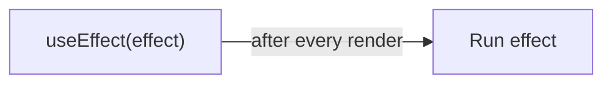
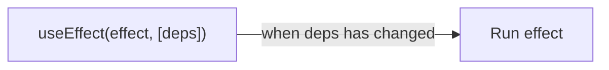
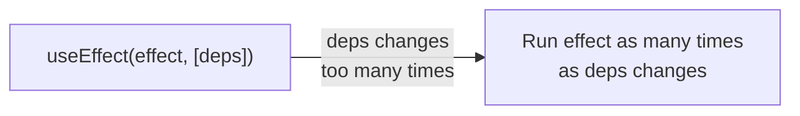
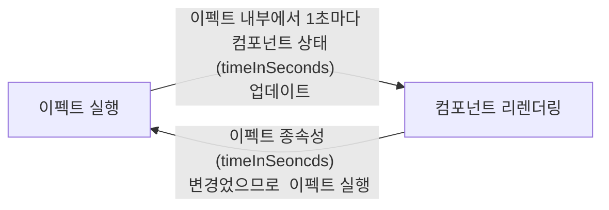

---
title: 리액트 useEffect 최적화하기 (feat. 타이머 컴포넌트)
date: 2022-02-22
categories: [TIL]
tags: [리액트, 오래된클로저, useeffect] # TAG names should always be lowercase
image:
  src: https://noticon-static.tammolo.com/dgggcrkxq/image/upload/v1566557331/noticon/d5hqar2idkoefh6fjtpu.png
  width: 100 # in pixels
  height: 100 # in pixels
  alt: React
mermaid: true
published: true
excerpt_separator: <!--end-of-description-->
---

## 💁 설명

`useEffect`를 사용할 때 자주 변하는 값을 의존성 배열에 넣으면 변하는 빈도만큼 이펙트가 실행되어 성능적으로 낭비가 될 수 있습니다. `useEffect`의 의존성 배열에 있는 종속성이 너무 자주 변경될 때 최적화할 수 있는 패턴을 타이머 컴포넌트를 예시로 들어서 정리합니다.

<!--end-of-description-->

<details>
<summary><strong>TR;DR</strong></summary>

이펙트에서 상태를 업데이트할 때 클로저를 사용하여 상태를 참조하면 <a href="https://dmitripavlutin.com/react-hooks-stale-closures/">오래된 클로저(stale closure)</a>가 발생할 수 있어서 의존성 배열에 상태를 추가해야만 한다. 결과적으로 상태가 바뀔 때마다 계속 이펙트가 실행된다. 하지만 상태를 업데이트할 때 함수로 처리하면 의존성 배열에 상태를 추가하지 않아도 최신 렌더링에 속한 상태를 이용할 수 있다. 그리고 의존성 배열에 상태가 빠지므로 상태가 바뀌더라도 이펙트를 실행하지 않게 되어 최적화를 할 수 있다.

</details>

## useEffect 최적화



리액트의 `useEffect` 훅은 기본적으로 컴포넌트를 마운트할 때와 업데이트할 때마다 실행됩니다.
모든 렌더링 이후에 이펙트(effect)를 적용하는 것은 때때로 성능 저하를 일으킬 수 있으므로 `useEffect`의 두 번째 인수에 의존성 배열을 전달하여 성능 최적화를 하는 것이 좋습니다.



리액트는 의존성 배열에 있는 값이 변경되지 않으면 이펙트를 건너뛰므로 불필요한 이펙트 수행을 줄여서 성능 최적화를 할 수 있습니다.

그런데 의존성 배열에 추가한 종속성이 너무 자주 변경되면 어떻게 될까요? 그때마다 이펙트가 실행되므로 최적화를 한 의미가 줄어듭니다.



타이머 컴포넌트를 예시로 들어서 `useEffect`의 의존성 배열에 있는 종속성이 너무 자주 변경될 때 최적화를 할 수 있는 방법을 정리합니다.

## 타이머 컴포넌트

타이머(`Timer`) 컴포넌트는 사용자가 버튼을 누르면 타이머 시간(`timeInSeconds`)을 1초씩 더해서 보여주고, 사용자가 버튼을 한 번 더 누르면 타이머 시간을 정지시킵니다.

<!-- prettier-ignore-start -->
```tsx
const Timer = () => {
  // state
  const [timeInSeconds, setTimeInSeconds] = useState<number>(0);
  const [isPaused, setIsPaused] = useState<boolean>(true);
  // effect
  useEffect(() => {
    // 타이머가 정지되어 있으면 얼리 리턴하여 이펙트를 종료합니다.
    if (isPaused) {
      return;
    }
    // 타이머 시간을 1초마다 1씩 더하는 setInterval을 실행합니다.
    const id = setInterval(() => {
      setTimeInSeconds(timeInSeconds + 1);
    }, 1000);
    // effect가 재실행되면 이전에 실행된 setInterval을 취소합니다.
    return () => clearInterval(id);
  }, [isPaused, timeInSeconds]);
  // UI
  return (
    <>
      <p>타이머 시간: {timeInSeconds}초</p>
      <button onClick={() => setIsPaused((prev) => !prev)}>
        {isPaused ? '시작' : '정지'}
      </button>
    </>
  );
};
```
{: file="Timer.tsx" }
<!-- prettier-ignore-end -->

리액트가 위 컴포넌트를 실행하는 순서는 다음과 같습니다.

초기 렌더링:

1. `useState`를 사용하여 타이머 정지 여부(`isPaused`)와 타이머 시간(`timeInSeconds`)을 초기화한다.
2. 브라우저가 DOM을 모두 그리고 나서 `useEffect`에 등록된 이펙트를 실행한다.
3. 타이머가 정지 여부의 초기값이 `true`이므로 얼리 리턴되어 이펙트가 종료된다.

사용자가 시작 버튼을 누른 경우:

1. 컴포넌트의 상태인 `isPaused`가 `false`로 변경되므로 컴포넌트가 리렌더링된다.
2. 브라우저가 DOM을 모두 그리고 나서 `useEffect`에 등록된 이펙트를 실행한다.
3. (타이머 정지 여부 값이 `false`이므로) 타이머 시간을 1초마다 1씩 더하는 `setInterval`을 실행한다.
4. `setInterval`에 의해 `timerInSeconds`값이 1초마다 1씩 증가한다.
5. 컴포넌트 상태인 `timeInSeconds`가 변경되었으므로 컴포넌트를 리렌더링한다.
6. 브라우저가 DOM을 모두 그리고 나서, (의존성 배열의 종속성인 `timeInSeconds`가 변경되었으므로) 이펙트를 실행한다.
7. 3~6을 반복한다.

즉, 한 번 이펙트가 실행되면, 컴포넌트 상태가 업데이트되고, 컴포넌트 상태(`timeInSeconds`)가 업데이트 되었으므로 컴포넌트가 리렌더링되고, DOM을 모두 그리고 나서 (이펙트의 의존성 배열의 종속성(`timeInSeconds`)도 변경되었으므로) 이펙트가 다시 실행되는 순환구조입니다.



[codesandbox](https://codesandbox.io/s/useeffec-timer-before-opt-ybw8yd?file=/src/App.js)에서 콘솔에 로그를 찍어서 직접 확인해보겠습니다.

<div style="display: flex; flex-direction: column; justify-content: center; align-items: center; filter: drop-shadow(2px 4px 6px rgba(0,0,0,0.08))">
  <video width="100%" controls autopaly muted loop>
    <source src="https://user-images.githubusercontent.com/8105528/155076716-8641604e-4a6e-4b97-b107-03ef9d2090e6.mov" />
  </video>
  <em style="display: block; text-align: center; font-style: normal; font-size: 80%; padding: 0; color: #6d6c6c; ">매초마다 effect가 실행된다</em>
</div>

### 단순화하기

생각해보면, "이펙트에서 상태를 업데이트하고 이펙트 의존성에 상태를 넣는 것"은 결국 컴포넌트 상태가 바뀔 때마다 이펙트를 실행하라는 것과 같은 의미이고, 컴포넌트 상태가 바뀌면 컴포넌트가 리렌더링되므로, "컴포넌트 리렌더링과 이펙트 실행을 순환적으로 실행"하도록 만듭니다.

타이머 컴포넌트에서 `useEffect`의 의존성 배열에 상태 `timeInSeconds`를 넣을 수밖에 없는 이유는 이펙트 코드가 컴포넌트 상태 `timeInSeconds`를 참조하고 있고, 이펙트가 실행될 때마다 최신 렌더링에 속하는 `timeInSeconds`를 참조해야 하기 때문입니다. 의존성 배열에 `timeInSeconds`를 생략할 경우 [오래된 클로저(stale closure)](https://dmitripavlutin.com/react-hooks-stale-closures/) 문제가 발생하여 이펙트는 초기 렌더링 때 참조했던 `timeInSeconds` 값(`0`)을 참조하게 되어 타이머 값이 `setTimeInSeconds(0 + 1)`로 인해 `1`로 증가한 이후로는 더 이상 증가하지 않는 버그가 발생합니다.

```tsx
useEffect(() => {
  setState(state + 1); // 👀 클로저를 사용하여 state를 참조하고 있다
}, [state]);
```

위 코드처럼 이펙트에서 상태를 업데이트하는 로직을 포함시키면서 이펙트 실행을 최적화할 수 있는 방법은 무엇일까요? [리액트 공식 문서 Hooks FAQ](https://ko.reactjs.org/docs/hooks-faq.html#what-can-i-do-if-my-effect-dependencies-change-too-often)를 보면 너무 자주 변하는 종속성에 대해 최적화를 하는 예시를 찾을 수 있습니다. 결론부터 말씀드리면, 리액트는 상태를 업데이트할 때 함수로 처리할 수 있다는 점을 이용하면 됩니다.

```tsx
useEffect(() => {
  setState((prevState) => newState);
}, []); // ✅ 의존성 배열에서 state를 제거할 수 있다
```

## 상태 업데이트를 함수로 처리하여 해결하기

<!-- prettier-ignore-start -->
```tsx
const Timer = () => {
  // ...state...
  // effect
  useEffect(() => {
    if (isPaused) {
      return;
    }
    const id = setInterval(() => {
      setTimeInSeconds((prevTime) => prevTime + 1);
    }, 1000);
    return () => clearInterval(id);
  }, [isPaused]);
  // ...UI...
};
```
{: file="Timer.tsx" }
<!-- prettier-ignore-end -->

이제 이펙트는 사용자가 버튼을 눌러서 `isPaused` 값이 변할 때만 실행되고 상태 `timeInSeconds` 이 변하더라도 실행되지 않습니다.

[codesandbox](https://codesandbox.io/s/useeffec-timer-after-opt-jc22yj?file=/src/App.js)에서 로그를 찍어서 확인해본 결과 다음과 같습니다.

<div style="display: flex; flex-direction: column; justify-content: center; align-items: center; filter: drop-shadow(2px 4px 6px rgba(0,0,0,0.08))">
<video width="100%" controls autopaly muted loop>
  <source src="https://user-images.githubusercontent.com/8105528/155088343-706e2371-cfb0-4f25-9667-56e97804ab25.mov" />
</video>
  <em style="display: block; text-align: center; font-style: normal; font-size: 80%; padding: 0; color: #6d6c6c; ">타이머 버튼을 누를 때만 effect가 실행된다</em>
</div>

## 📚 함께 보기

- [React - Hooks FAQ: What can I do if my effect dependencies change too often](https://ko.reactjs.org/docs/hooks-faq.html#what-can-i-do-if-my-effect-dependencies-change-too-often)
- [codesandbox - 타이머 컴포넌트 최적화 이전](https://codesandbox.io/s/useeffec-timer-before-opt-ybw8yd?file=/src/App.js)
- [codesandbox - 타이머 컴포넌트 최적화 이후](https://codesandbox.io/s/useeffec-timer-after-opt-jc22yj?file=/src/App.js)
- [오래된 클로저(stale closure)](https://dmitripavlutin.com/react-hooks-stale-closures/)