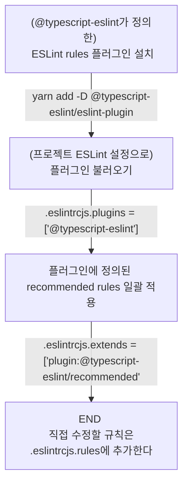

---
title: ESLint 설정 뜯어보기 (feat. React, TypeScript)
date: 2022-01-26
categories: [TIL]
tags: [eslint, 리액트] # TAG names should always be lowercase
image:
  src: https://noticon-static.tammolo.com/dgggcrkxq/image/upload/v1599890132/noticon/c9dgkhp3m5rxmzn3fnp9.png
  width: 100 # in pixels
  height: 100 # in pixels
  alt: ESLint
mermaid: true
excerpt_separator: <!--end-of-description-->
---

## 목표

리액트와 타입스크립트를 쓰는 프로젝트에서 자주 사용하는 ESLint 설정을 정리합니다.

<!--end-of-description-->

<details markdown="1">
<summary><strong>TL;DR</strong></summary>

- 플러그인에 정의된 프리셋 규칙을 즉시 적용하고 싶다면: `extends`
- 플러그인에 정의된 규칙을 개별적으로 적용하고 싶다면: `plugins`로 불러오고 `rules`에 추가한다

```js
module.exports = {
  // ...생략...
  plugins: ["@typescript-eslint", "prettier", "jest", "unicorn"],
  extends: [
    "airbnb",
    "prettier",
    "prettier/react",
    "plugin:prettier/recommended",
    "plugin:jest/recommended",
    "plugin:unicorn/recommended",
  ],
  rules: {
    "no-console": "warn",
    "no-unused-vars": "off",
    "@typescript-eslint/no-unused-vars": [
      "error",
      { vars: "all", args: "after-used", ignoreRestSiblings: false },
    ],
    "@typescript-eslint/explicit-function-return-type": "warn",
  },
};
```

</details>

## 용어 정리

용어를 이해하면 ESLint 설정이 어떤 구조로 동작하는지 대략적으로 알 수 있습니다. 앞으로 글에서 말하는 `린트`는 `ESLint`를 의미하고 `린트 설정 객체`는 `.eslintrc.js`에서 내보내는 자바스크립트 객체를 의미합니다.

**ESLint 패키지:**

<!-- prettier-ignore-start -->

| 용어 | 뜻 | 예시 |
| :---: | :---: | :---: |
| `eslint-plugin-*` | 커스텀 린트 규칙을 정의한 패키지 | [`eslint-plugin-react`](https://github.com/yannickcr/eslint-plugin-react) |
| `eslint-config-*` | 린트 규칙뿐만 아니라 다른 ESLint 설정까지 정의한 패키지 {::nomarkdown}</br>{:/} (`eslint-config-*`를 포함하기도 한다) | [`eslint-config-airbnb`](https://www.npmjs.com/package/eslint-config-airbnb) |

<!-- prettier-ignore-end -->

**린트 설정 객체 프로퍼티:**

<!-- prettier-ignore-start -->

| 용어 | {::nomarkdown} <div style="width:290px"> 뜻 </div> {:/}| 자주 사용하는 값 | 비고 |
| :---: | :--- | :--- | :--- |
| root | {::nomarkdown}<li>린트를 적용할 프로젝트의 루트가 현재 린트 설정 파일과 동일한 레벨에 있다</li> <li>따라서 부모 디렉토리는 린팅 대상에 포함하지 않는다</li> {:/} | `true` 또는 생략 |
| [env](https://eslint.org/docs/user-guide/configuring/language-options#specifying-environments) | {::nomarkdown}<li>프로젝트가 실행될 환경을 정의한다</li> <li>각 환경에 맞는 전역 변수를 사전에 제공한다</li> {:/} | `{ browser: true, es2021: true, node: true, jest: true }` | `es*` 값을 사용하면 파서 옵션의 `ecmaVersion`도 자동으로 설정된다 |
| [parser](https://eslint.org/docs/user-guide/configuring/plugins#specifying-parser) | {::nomarkdown}<li>ESLint가 사용할 파서를 정의한다</li> <li>타입스크립트의 경우 `@typescript-eslint/parser`를 사용한다</li> {:/} |
| [parserOptions](https://eslint.org/docs/user-guide/configuring/language-options#specifying-parser-options) | {::nomarkdown}<li>프로젝트에서 사용할 자바스크립트 언어 옵션을 정의한다</li> {:/} | `{ "sourceType": "module", "ecmaFeatures": { "jsx": true } }` |
| [parserOptions.project](https://github.com/typescript-eslint/typescript-eslint/tree/main/packages/parser#parseroptionsproject) | {::nomarkdown}<li>(`@typescript-eslint`에서 제공하는) 타입 정보를 필요로 하는 린트 규칙을 적용하려면 설정해야 한다</li> {:/} | `"./tsconfig.json"` | `.js` 확장자 파일을 읽을 때 에러가 발생할 수 있다 {::nomarkdown} </br> {:/} 따라서 이 경우에는 [타입스크립트 규칙은 타입스크립트 파일에만 적용하도록 오버라이드](https://stackoverflow.com/a/64488474) 할 수 있다 |
| [plugins](https://eslint.org/docs/user-guide/configuring/plugins#configuring-plugins) | {::nomarkdown}<li>ESLint 설정에 사용할 플러그인을 불러온다</li> <li>규칙을 불러올 뿐 자동으로 **적용되지는 않는다**</li> {:/} | `["@typescript-eslint"]` |
| [extends](https://eslint.org/docs/user-guide/configuring/configuration-files#extending-configuration-files) | {::nomarkdown}<li>상속 받아서 **바로 적용**할 다른 ESLint 설정 파일을 정의한다</li> <li markdown="1">`recommended` 같은 키워드를 사용하면 패키지에 정의된 프리셋 규칙이 일괄 적용된다</li> {:/} | [예제 코드](https://github.com/datalater/react-boilerplate/blob/main/.eslintrc.js#L9) | 나중에 정의한 값이 더 높은 우선순위를 갖는다 |

<!-- prettier-ignore-end -->

## 예제로 살펴보는 ESLint 설정 파일

여러 공식문서에서 제공하는 `.eslintrc.js` 파일을 둘러봅니다. 주요 키워드는 `plugins`, `extends`, `rules`입니다.

### typescript-eslint

> [typescript-eslint - Configuration](https://typescript-eslint.io/docs/linting/)

**설치:**

```bash
yarn add --dev eslint typescript @typescript-eslint/{eslint-plugin,parser}
```

**린트 설정 파일 작성:**

<!-- prettier-ignore-start -->
```js
module.exports = {
  root: true,
  parser: "@typescript-eslint/parser",
  plugins: ["@typescript-eslint"],
  extends: ["eslint:recommended", "plugin:@typescript-eslint/recommended"],
};
```
{: file=".eslintrc.js" }
<!-- prettier-ignore-end -->

**정리:**

위 내용을 토대로 ESLint 플러그인을 적용하는 과정을 정리해보면 다음과 같습니다.



> 단, [`eslint-plugin-react`](https://github.com/yannickcr/eslint-plugin-react/blob/master/index.js#L125)처럼 코드 내부에서 `recommended` 안에 플러그인을 불러오는 코드가 있는 경우, 플러그인 불러오기 과정 없이 `extends`만 작성해도 린트 규칙을 적용할 수 있다.

### React Typescript Cheatsheet

> [React Typescript Cheatsheet - Linting](https://react-typescript-cheatsheet.netlify.app/docs/basic/linting/)

<!-- prettier-ignore-start -->

```js
module.exports = {
  env: {
    es6: true,
    browser: true,
    jest: true,
  },
  parser: "@typescript-eslint/parser",
  parserOptions: {
    sourceType: "module",
    ecmaFeatures: {
      jsx: true,
    },
  },
  plugins: ["@typescript-eslint", "prettier", "jest", "unicorn"],
  extends: [
    "airbnb",
    "prettier",
    "prettier/react",
    "plugin:prettier/recommended",
    "plugin:jest/recommended",
    "plugin:unicorn/recommended",
  ],
  rules: {
    indent: ["error", 2],
    "linebreak-style": ["error", "unix"],
    quotes: ["error", "single"],
    "no-console": "warn",
    "no-unused-vars": "off",
    "@typescript-eslint/no-unused-vars": [
      "error",
      { vars: "all", args: "after-used", ignoreRestSiblings: false },
    ],
    "@typescript-eslint/explicit-function-return-type": "warn", // Consider using explicit annotations for object literals and function return types even when they can be inferred.
    "no-empty": "warn",
  },
};
```
{: file=".eslintrc.js" }
<!-- prettier-ignore-end -->

이제 위 린트 설정 파일을 보면,

- `plugins`: '네 개의 플러그인이 갖고 있는 린트 규칙 모음을 활용하겠구나'
- `extends`: '여섯 가지 패키지의 규칙 모음을 위에서부터 아래로 바로 적용하고, 규칙뿐만 아니라 다른 ESLint 설정도 불러오는구나'
- `rules`: '몇 가지 규칙은 직접 추가해서 변경하는구나'

라고 이해할 수 있습니다.

## See also

- 공식 문서
  - [ESLint - configuring](https://eslint.org/docs/user-guide/configuring/)
- 기타 자료
  - [stackoverflow - 타입스크립트 린트 규칙을 적용할 때 자바스크립트 파일은 제외하고 타입스크립트 파일에만 적용하기](https://stackoverflow.com/a/64488474)
  - [TSLint 에서 ESLint 로 이사하기](https://pks2974.medium.com/tslint-%EC%97%90%EC%84%9C-eslint-%EB%A1%9C-%EC%9D%B4%EC%82%AC%ED%95%98%EA%B8%B0-ecd460a1e599): `parserOptions.project: "./tsconfig.json"`로 하면 JS 파일에서 에러가 발생할 수 있다
  - [nana.log - ESLint 알고 쓰기](https://yrnana.dev/post/2021-09-02-eslint): ESLint config와 plugin의 차이점
  - [Webpack으로 React + TypeScript + Styled Component + Storybook 세팅하기](https://yujo11.github.io/React/React-TS-Webpack-%EC%84%B8%ED%8C%85/)
  - [Typescript & React & Eslint 환경설정 2편 ESLint & Prettier 설정](https://velog.io/@xortm854/Typescript-React-Eslint-%ED%99%98%EA%B2%BD%EC%84%A4%EC%A0%95-2%ED%8E%B8-ESLint-Prettier-%EC%84%A4%EC%A0%95)